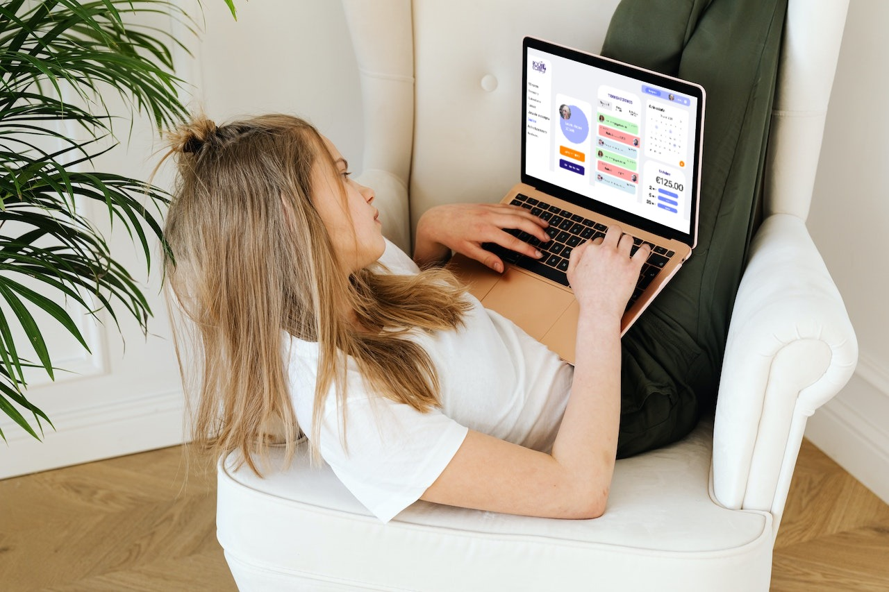

# Roomie Connect

## Descripción del Proyecto

Roomie Connect es una aplicación de gestión de tareas y gastos compartidos diseñada para compañeros de piso. Facilita la colaboración y la organización en la vida compartida, permitiendo a los usuarios llevar un registro de las tareas pendientes y los gastos compartidos de manera eficiente.

Características Clave:

Gestión de Tareas: Roomie Connect facilita la creación y asignación de tareas en el hogar. Cada compañero de piso puede crear tareas, asignarlas a otros miembros y realizar un seguimiento de su estado de finalización. Esto garantiza que las responsabilidades en el hogar estén claras y equitativamente distribuidas.

Registro de Gastos Compartidos: La aplicación permite a los usuarios registrar los gastos compartidos de manera eficiente. Al ingresar los gastos, Roomie Connect calcula automáticamente las contribuciones equitativas de cada compañero de piso, simplificando así la contabilidad y la división de gastos.

Listas de Compras Compartidas: Con la función de listas de compras compartidas, los compañeros de piso pueden crear y gestionar listas de compras de forma colaborativa. Esto garantiza que no falte nada en casa y evita compras innecesarias.

Notificaciones Personalizadas: Roomie Connect mantiene a todos los compañeros de piso informados a través de notificaciones personalizadas. Recibe recordatorios sobre tareas pendientes, gastos compartidos y otras actualizaciones importantes.

Noticias: Se publican anuncios y actualizaciones de temas importantes relacionados con la convivencia.

Roomie Connect está en constante desarrollo y mejora para satisfacer las necesidades cambiantes de los compañeros de piso modernos. Nuestro objetivo es simplificar la convivencia y fomentar un ambiente armonioso en el hogar compartido.

## Estado del Proyecto

:construction: Proyecto en construcción :construction:

Estamos trabajando arduamente para desarrollar todas las funciones y características que hacen que Roomie Connect sea una herramienta útil y práctica para la vida en compañía.

## Funcionalidades del proyecto

:hammer:Las principales funciones que estamos desarrollando incluyen:

Gestión de Tareas
La función de gestión de tareas de Roomie Connect permite a los usuarios:
Crear tareas con detalles y fechas de vencimiento.
Asignar tareas a otros compañeros de piso.
Marcar tareas como completadas o pendientes.
Recibir notificaciones sobre tareas pendientes.

Registro de Gastos Compartidos
La función de registro de gastos compartidos de Roomie Connect incluye:
Registrar gastos con descripción y monto.
Calcular automáticamente las contribuciones equitativas de cada compañero de piso.
Visualizar un historial de gastos compartidos.

Listas de Compras Compartidas
Las listas de compras compartidas permiten a los usuarios:
Crear y gestionar listas de compras colaborativas.
Marcar elementos como comprados o pendientes.
Evitar compras duplicadas y asegurarse de que nunca falte nada en casa.

Notificaciones Personalizadas
Roomie Connect envía notificaciones para:
Informar sobre nuevos gastos compartidos y actualizaciones en las listas de compras.
Mantener a los compañeros de piso al tanto de las novedades en la vivienda.

Noticias
La función de blogs internos permite a los miembros de la vivienda:
Revisar los anuncios y actualizaciones generados de temas importantes relacionados con la convivencia.

## Acceso al Proyecto

Puedes acceder al proyecto en el siguiente enlace: [Roomie Connect en GitHub](https://github.com/4GeeksAcademy/Group_Roomie-Final_Proyect).

## Tecnologías Utilizadas

Este proyecto está desarrollado utilizando las siguientes tecnologías:

- Frontend: HTML, CSS, JavaScript, Tailwind
- Backend: Python, Flask
- Base de Datos: PostgreSQL

## Personas Desarrolladoras del Proyecto

Este proyecto está siendo desarrollado por el equipo de Roomie Connect:

- [Miguel Pérez](https://github.com/MPMiguel)
- [Remug Smith](https://github.com/Remug)
- [Johanna Alamo](https://github.com/johannaalamo)
- [Sandra Rodríguez](https://github.com/srdgz)

¡Gracias por tu interés en Roomie Connect!